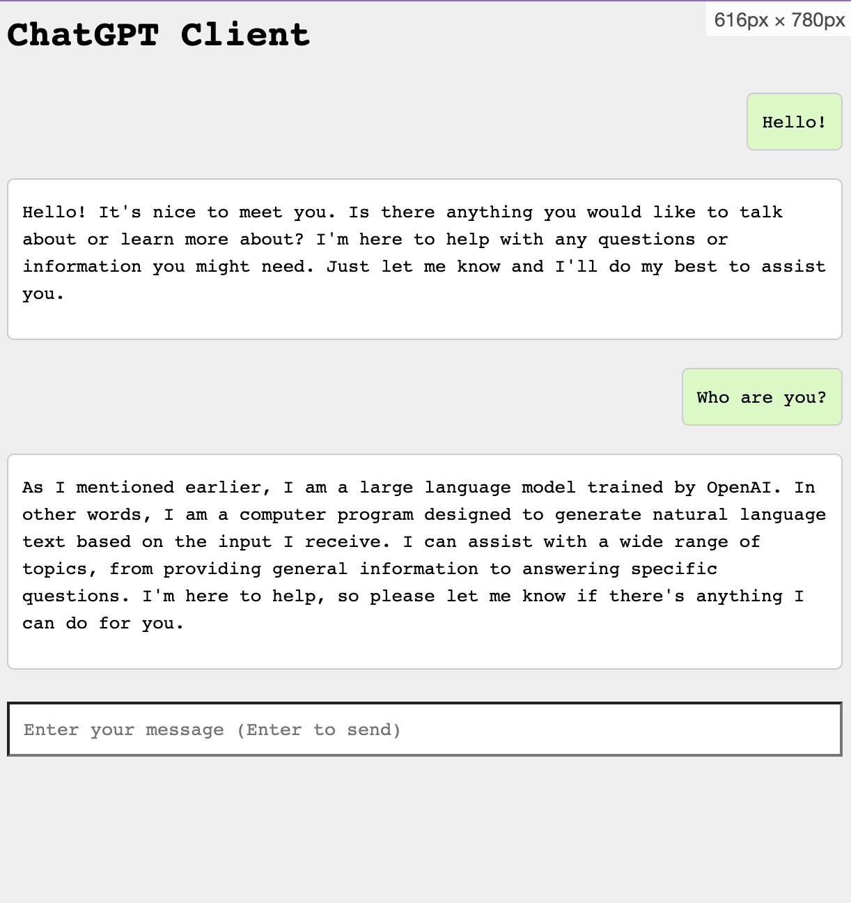

# ChatGPT Server for Node.js

This is a NodeJS server for [ChatGPT](https://chat.openai.com/chat). It uses Playwright to send and get messages.

## Installation

```bash
npm install
```

## Usage

```bash
npm start
```

A Chromium browser will open. the ChatGPT home page. Login with your OpenAI account. Then, return to the temrinal and press `Enter`. The server will start on port `5001`.

Make a request:

```bash
curl http://localhost:5001/api/chat?prompt=Hello
```

Response is `text/html`. For example:

```html
<p>
  Hi there! Is there something you need help with? I'm a large language model
  trained by OpenAI, and I can assist you with a wide range of topics. Let me
  know if you have any questions or need any information. I'll do my best to
  help!
</p>
```

## Demo client implementation

Visit http://localhost:5001 on your browser for a demo client implementation (find the code in `index.html`)



Enjoy!
